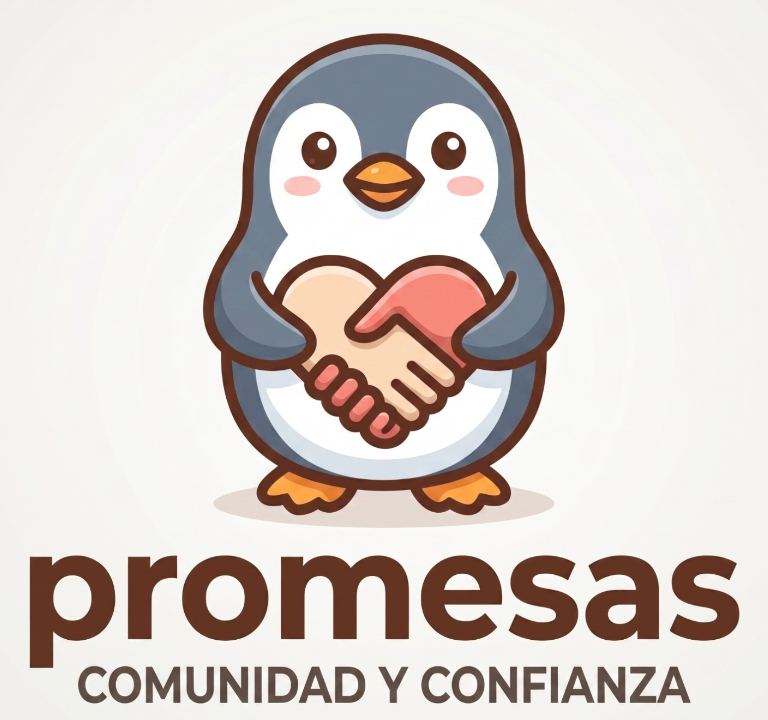

<p align="center">
  
</p>

<h1 align="center">CSESI Promesas G11</h1>

<p align="center">
  Proyecto educativo de ciberseguridad desarrollado por el equipo SCESI Promesas.
</p>


Proyecto grupal desarrollado para practicar Git, GitHub, ramas, commits, Pull Requests, reviews y buenas prácticas de trabajo colaborativo.

## Integrantes
```
| Nombre completo | Teléfono | Correo electrónico |
|---|---:|---|
| Jose Brayan Cruz Muruchi | 77989553 | jbcruz88888@gmail.com |
| Andrés Orlando Chávez Rosales | 67487957 | andresochavezr@gmail.com |
| Veliz Mamani Darlyn Alejandra | 77433898 | darlinalejandra87@gmail.com |
| Viraca Pacolla Joel Carlos | 64866872 | joelviraca@gmail.com |
```
## Tema del proyecto

Este proyecto consiste en un sitio web educativo sobre ciberseguridad.  
Su objetivo es explicar de forma clara, visual y práctica conceptos básicos relacionados con amenazas comunes, protección digital, seguridad web, prevención y buenas prácticas al navegar por internet.

## Objetivos del proyecto

- Practicar el uso de Git y GitHub en equipo.
- Aplicar un flujo de trabajo basado en ramas.
- Utilizar ramas principales como `main` y `develop`.
- Crear ramas `feature` para desarrollar funcionalidades específicas.
- Realizar commits pequeños, claros y descriptivos.
- Trabajar mediante Pull Requests.
- Aplicar revisiones de código antes de integrar cambios.
- Crear un sitio web informativo, ordenado y responsive.

## Tecnologías utilizadas

- HTML5
- CSS3
- JavaScript
- Git
- GitHub

## Estructura del proyecto


```
csesi-promesas-g11/
├── index.html
├── proteccion.html
├── styles.css
├── script.js
└── README.md
```

### Módulos del sitio web

El sitio web está dividido en diferentes secciones:

Inicio: Presentación general del proyecto.
Amenazas comunes: Información sobre ataques como phishing, malware, ransomware, spyware e ingeniería social.
Protección y privacidad: Buenas prácticas para proteger cuentas, contraseñas, datos personales y dispositivos.
Seguridad web: Explicación de HTTPS, cookies, formularios seguros y riesgos al navegar.
Prevención: Recomendaciones para evitar enlaces sospechosos, descargas inseguras y sitios falsos.
Quiz interactivo: Preguntas básicas para reforzar los conocimientos aprendidos.
Flujo de trabajo

El equipo trabaja usando ramas separadas por funcionalidad.

### Ramas principales
main
develop
main: rama principal del proyecto estable.
develop: rama de integración donde se unen las funcionalidades antes de pasar a main.

### Ramas de trabajo
```bash
feature/add-home-page
feature/add-cyber-threats-section
feature/add-cyber-protection-section
feature/add-web-security-quiz
feature/integrate-web-security-quiz
```
Cada integrante trabaja en una rama feature y luego crea un Pull Request hacia develop.

### Cómo ejecutar el proyecto
1. Clonar el repositorio
```bash
git clone git@github.com:ChAndres05/scesi-promesas-g11.git
```
2. Entrar a la carpeta del proyecto
```bash
cd scesi-promesas-g11
```
3. Abrir el proyecto
Abrir el archivo index.html en el navegador.
